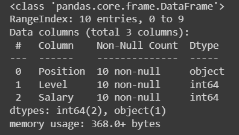

# Implementation-of-Decision-Tree-Regressor-Model-for-Predicting-the-Salary-of-the-Employee

## AIM:
To write a program to implement the Decision Tree Regressor Model for Predicting the Salary of the Employee.

## Equipments Required:
1. Hardware – PCs
2. Anaconda – Python 3.7 Installation / Jupyter notebook

## Algorithm
1.Import the required packages.

2.Read the data set.

3.Apply label encoder to the non-numerical column inoreder to convert into numerical values.

4.Determine training and test data set.

5.Apply decision tree regression on to the dataframe and get the values of Mean square error, r2 and data prediction.

## Program:
Program to implement the Decision Tree Regressor Model for Predicting the Salary of the Employee.

Developed by: Kathirvelan.K

RegisterNumber:212221220026

```
import pandas as pd
data=pd.read_csv("Salary.csv")

data.head()

data.info()

data.isnull().sum()

from sklearn.preprocessing import LabelEncoder
le=LabelEncoder()

data["Position"]=le.fit_transform(data["Position"])
data.head()

x=data[["Position","Level"]]
y=data["Salary"]

from sklearn.model_selection import train_test_split
x_train,x_test,y_train,y_test=train_test_split(x,y,test_size=0.2,random_state=2)

from sklearn.tree import DecisionTreeRegressor
dt=DecisionTreeRegressor()
dt.fit(x_train,y_train)
y_pred=dt.predict(x_test)

from sklearn import metrics
mse=metrics.mean_squared_error(y_test,y_pred)
mse

r2=metrics.r2_score(y_test,y_pred)
r2

dt.predict([[5,6]])
```

## Output:

Data.head()


Data.info()



Data.isnull().sum()


Data.head() for salary


MSE value


r2 value


Data prediction


## Result:
Thus the program to implement the Decision Tree Regressor Model for Predicting the Salary of the Employee is written and verified using python programming.
